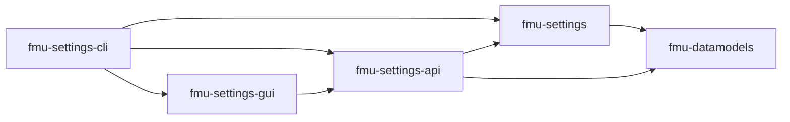

# fmu-settings

[](https://github.com/equinor/fmu-settings/actions/workflows/ci.yml)
[](https://github.com/equinor/fmu-settings/actions/workflows/docs.yml)

**Documentation**: <a href="https://equinor.github.io/fmu-settings/" target="_blank">https://equinor.github.io/fmu-settings/</a>

**Source code**: <a href="https://github.com/equinor/fmu-settings/" target="_blank">https://github.com/equinor/fmu-settings/</a>

`fmu-settings` is the Python core library for managing `.fmu/` directories in FMU projects and user environments.

It owns the filesystem behavior around project settings: initialization, discovery, configuration models, resource managers, locking, cache handling, changelogs, restore behavior, and synchronization helpers.

## Where It Fits

FMU Settings is split across a few repositories:



- [`fmu-settings`](https://github.com/equinor/fmu-settings) is the core `.fmu/` library.
- [`fmu-datamodels`](https://github.com/equinor/fmu-datamodels) provides shared Pydantic domain models.
- [`fmu-settings-api`](https://github.com/equinor/fmu-settings-api) exposes the library through a FastAPI application layer.
- [`fmu-settings-gui`](https://github.com/equinor/fmu-settings-gui) provides the browser-based user interface.
- [`fmu-settings-cli`](https://github.com/equinor/fmu-settings-cli) bootstraps local user state, launches the API and GUI, and exposes utility commands.

See [ARCHITECTURE.md](ARCHITECTURE.md) for the library architecture and a high-level ecosystem overview.

## Documentation

The published documentation is the best starting point for users:

- [Overview](https://equinor.github.io/fmu-settings/overview.html)
- [Getting started](https://equinor.github.io/fmu-settings/getting_started.html)
- [GUI user guide](https://equinor.github.io/fmu-settings/gui_user_guide.html)
- [Terminal commands](https://equinor.github.io/fmu-settings/terminal_commands.html)

Documentation sources live under `docs/src/`.

## Developing

Clone and install into a virtual environment.

```sh
git clone git@github.com:equinor/fmu-settings.git
cd fmu-settings
# Create or source virtual/Komodo env
pip install -U pip
pip install -e ".[dev]"
# Make a feature branch for your changes
git checkout -b some-feature-branch
```

Run the tests with:

```sh
pytest -n auto tests
```

Ensure your changes will pass the various linters before making a pull
request. It is expected that all code will be typed and validated with
mypy.

```sh
ruff check
ruff format --check
mypy src tests
```

See [CONTRIBUTING.md](CONTRIBUTING.md) for more.
